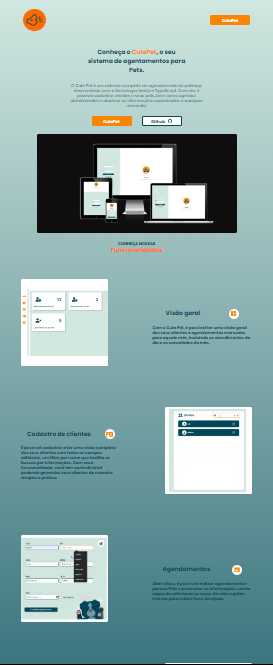

#

<h1>Cute Pet   

Landing Page

</h1>

## Descrição

[Ver Projeto](https://cutepet-landing-page.vercel.app/) 🐶🐱🐾

#### Landing Page voltada ao meu projeto [CutePet](https://schedule-petshop-system.vercel.app)

#

 

⚙️ **Configuranções e Instalações**

Clone do Projeto

    $ git clone https://github.com/renovatt/cutepet-landing-page.git

Instalando as dependências

    $ npm install

Iniciando o projeto

    $ npm run dev

 

**Como contribuir?**

- Você pode dar suporte me seguindo aqui no GitHub
- Dando uma estrela no projeto
- Criar uma conexão comigo no linkedin fazendo parte da minha networking e curtir o meu projeto.

 

**Autor**
[Wildemberg Renovato de Lima](https://www.linkedin.com/in/renovatt/)